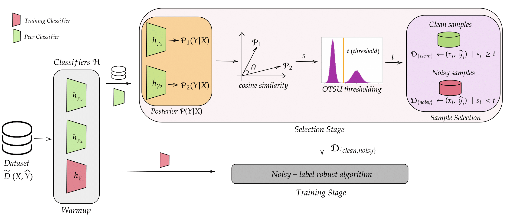

# PASS: Peer-Agreement based Sample Selection for Training with Instance Dependent Noisy Labels

This repository implements the Peer-Agreement based Sample Selection (PASS) method for training deep neural networks with noisy labels, as described in the paper: "PASS: Peer-Agreement based Sample Selection for Training with Instance Dependent Noisy Labels".

## Overview

PASS is a novel approach to identify clean and noisy labeled samples in datasets with label noise. Unlike traditional methods that rely on loss values or feature similarity, PASS leverages the **agreement between multiple peer networks** to determine which samples are likely to have correct labels.

The key insight is that different models often agree on samples with clean labels but disagree on samples with noisy labels. This makes PASS particularly effective for **Instance-Dependent Noise (IDN)** scenarios, where the probability of label noise depends on the content of the samples themselves.



## Key Features

- **Robust to Instance-Dependent Noise**: Unlike many existing methods that primarily work with instance-independent noise, PASS is specifically designed to handle the more realistic scenario of instance-dependent noise.
- **Automatic Threshold Selection**: Uses Otsu's algorithm to automatically determine the optimal threshold for clean/noisy separation.
- **Highly Integrable**: Can be integrated into various existing noisy-label learning frameworks.
- **No Clean Validation Set Required**: Works without the need for a separate clean validation set.

## Installation

```bash
# Clone the repository
git clone https://github.com/yourusername/pass-noisy-labels.git
cd pass-noisy-labels

# Install dependencies
pip install -r requirements.txt
```

## Requirements

The main dependencies are:
```bash
torch>=1.7.0
torchvision>=0.8.1
numpy>=1.19.2
scikit-learn>=0.23.2
matplotlib>=3.3.2
tqdm>=4.50.2
pillow>=8.0.1
```
For a complete list of dependencies, see `requirements.txt`.

## Usage

This implementation demonstrates PASS integrated with DivideMix. However, as mentioned in the paper, PASS can be easily integrated into other learning with noisy labels (LNL) methods such as InstanceGM, SSR, FaMUS, AugDesc, and C2D.

### Basic Usage

To train a DivideMix model on CIFAR-100 with symmetric noise:

```bash
python main.py --dataset cifar100 --r 0.5
```

To use DivideMix-PASS for sample selection:

```bash
python main.py --dataset cifar100 --r 0.5 --use_pass
```

### Available Arguments

- `--dataset`: Dataset to use (cifar10, cifar100)
- `--r`: Noise ratio [default: 0.5]
- `--noise_mode`: Noise type (sym, asym) [default: sym]
- `--use_pass`: Enable PASS for sample selection
- `--num_epochs`: Number of training epochs [default: 300]
- `--batch_size`: Training batch size [default: 64]
- `--lr`: Initial learning rate [default: 0.02]
- `--num_class`: Number of classes [default: 10]
- `--data_path`: Path to dataset [default: ./data]

## How PASS Works

PASS uses three neural networks trained in a round-robin fashion:

1. **Warmup Phase**: All three networks are warmed up using standard cross-entropy loss.

2. **Selection Phase**: For each network:
   - The other two networks act as peer classifiers and evaluate all samples
   - The cosine similarity is calculated between the predictions of these two networks
   - Otsu's thresholding algorithm automatically determines the optimal threshold to separate clean and noisy samples
   - Samples with high agreement (above threshold) are considered clean and used with their original labels
   - Samples with low agreement (below threshold) are considered noisy and treated as unlabeled data

3. **Training Phase**: Each network is trained using semi-supervised learning with MixMatch, where clean samples form the labeled set and noisy samples form the unlabeled set.

## Results

PASS consistently improves the performance of various LNL methods on multiple benchmarks:

| Dataset | Noise Type | Noise Rate | DivideMix | DivideMix+PASS | Improvement |
|---------|------------|------------|-----------|----------------|-------------|
| CIFAR-100 | IDN | 0.2 | 77.07% | 77.41% | +0.34% |
| CIFAR-100 | IDN | 0.3 | 76.33% | 76.58% | +0.25% |
| CIFAR-100 | IDN | 0.4 | 70.80% | 75.07% | +4.27% |
| CIFAR-100 | IDN | 0.45 | 57.78% | 72.91% | +15.13% |
| CIFAR-100 | IDN | 0.5 | 58.61% | 72.27% | +13.66% |

For a complete overview of experimental results, please refer to the paper.

## Advantages Over Other Methods

- **Loss-based methods** (DivideMix, Co-teaching): These methods assume that noisy samples have high loss values, which isn't always true with instance-dependent noise.
- **Feature-based methods** (FINE): These methods rely on feature similarity, which can conflate hard but correctly labeled samples with noisy ones.
- **PASS**: Leverages consensus between peer networks to identify clean samples, making it more robust to various types of noise, especially instance-dependent noise.

## Integrating PASS into Other Frameworks

To integrate PASS into your own noisy label learning framework:

1. **Create three networks** instead of the usual one or two.
2. **Implement the peer agreement selection mechanism**:
   ```python
   def pass_selection(net1, net2, eval_loader):
       # Calculate agreement between peer networks
       # Apply Otsu's thresholding
       # Return binary mask (1 for clean, 0 for noisy)
   ```
3. **Use round-robin training**:
   - When training network 1, use networks 2 and 3 for sample selection
   - When training network 2, use networks 1 and 3 for sample selection
   - When training network 3, use networks 1 and 2 for sample selection

## Citation

If you use this code in your research, please cite the original paper:

```
@article{garg2023pass,
  title={PASS: Peer-Agreement based Sample Selection for Training with Instance Dependent Noisy Labels},
  author={Garg, Arpit and Nguyen, Cuong and Felix, Rafael and Do, Thanh-Toan and Carneiro, Gustavo},
  arxiv={https://arxiv.org/pdf/2303.10802},
  year={2023}
}
```

## License

This project is licensed under a Non-Commercial Research License - see the [LICENSE](LICENSE) file for details. You are free to use this code for research and educational purposes, but commercial use is prohibited without permission from the authors.

## Acknowledgments

- The original DivideMix implementation
- The authors of the PASS paper for their novel method

## Contact

For questions or issues, please open an issue on this repository or contact arpit.rikki2412@gmail.com.
